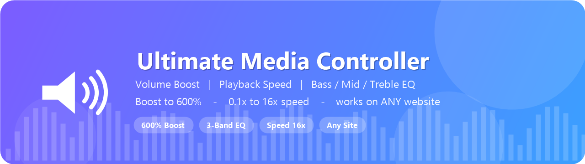
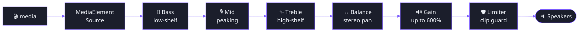

<div align="center">




<br/>


<br/><br/>


<p>
  <b>
  <a href="#-features">Features</a> &nbsp;•&nbsp;
  <a href="#-install">Install</a> &nbsp;•&nbsp;
  <a href="#-usage">Usage</a> &nbsp;•&nbsp;
  <a href="#-keyboard-shortcuts">Shortcuts</a> &nbsp;•&nbsp;
  <a href="#-how-it-works">How it works</a> &nbsp;•&nbsp;
  <a href="#-troubleshooting">Troubleshooting</a>
  </b>
</p>

<i>The ultimate volume booster, speed controller and equalizer for every video &amp; audio player on the web.</i>

</div>

<br/>

> **Ultimate Media Controller** is a powerful, dependency-free Chrome (Manifest V3) extension that takes over the volume, playback speed and tone of **any** `<video>` or `<audio>` on **any** website — YouTube, Netflix, Twitch, Vimeo, embeds, single-page apps, Shadow DOM and iframes included. It stays completely idle until you touch a control, so it never slows your browsing down.

<br/>

## ✨ Features

<table>
  <tr>
    <td width="50%" valign="top">

### 🔊 Volume Boost to 600%
Smash through the site's 100% ceiling with a real Web Audio gain stage — plus a built-in **limiter** that keeps boosted audio from clipping.

  </td>
  <td width="50%" valign="top">

### ⚡ Speed 0.1× → 16×
Slow-mo lectures or blaze through podcasts. Pitch stays natural, and the speed is **re-asserted every second** so sites like YouTube can't snap it back.

  </td>
  </tr>
  <tr>
  <td width="50%" valign="top">

### 🎚️ 3-Band Equalizer
Independent **Bass**, **Mid** and **Treble** (±15 dB) plus **Left / Right balance** — shape voice, music or movies exactly how you like.

  </td>
  <td width="50%" valign="top">

### 🌐 Works Everywhere
Discovers media in **Shadow DOM**, **iframes**, **SPAs** and players that load late. Settings are remembered **per-site**, with a global default.

  </td>
  </tr>
  <tr>
    <td width="50%" valign="top">

### 🪟 On-Page Panel + Popup
A polished, **draggable glass HUD** you can summon on any page (and it survives fullscreen), plus a toolbar popup. Live values, presets, the works.

  </td>
  <td width="50%" valign="top">

### 🚀 Idle-by-Default Performance
Zero overhead until you change something — no audio wiring, no scans, no fighting the page. Heavy work happens **only** the moment you adjust.

  </td>
  </tr>
</table>

<br/>

## 🚀 Install

> Requires **Chrome 111+** (or any Chromium browser — Edge, Brave, Opera).

```text
1.  Open  chrome://extensions
2.  Toggle  Developer mode  (top-right)
3.  Click  Load unpacked
4.  Select this folder
5.  Pin the 🔊 icon to your toolbar
```

<div align="center">
<sub>That's it — no build step, no npm, no dependencies. Open a page with a video and start cranking.</sub>
</div>

<br/>

## 🎛️ Usage

Click the **🔊 toolbar icon** for the full popup, or press <kbd>Alt</kbd>+<kbd>V</kbd> to drop the **on-page panel** onto any site.

<div align="center">
<table>
<tr><th>Control</th><th>Range</th><th>What it does</th></tr>
<tr><td>🔊 Volume</td><td><code>0 – 600%</code></td><td>Native below 100%, Web Audio boost above</td></tr>
<tr><td>⚡ Speed</td><td><code>0.1× – 16×</code></td><td>Slow down / speed up, pitch preserved</td></tr>
<tr><td>🥁 Bass</td><td><code>±15 dB</code></td><td>Low-shelf @ 200 Hz</td></tr>
<tr><td>🎙️ Mid</td><td><code>±15 dB</code></td><td>Peaking @ 1 kHz</td></tr>
<tr><td>✨ Treble</td><td><code>±15 dB</code></td><td>High-shelf @ 3.2 kHz</td></tr>
<tr><td>↔️ Balance</td><td><code>L – R</code></td><td>Stereo pan</td></tr>
</table>
</div>

### 🎚️ One-tap presets

<div align="center">

`⚡ Boost` &nbsp; `🔥 Max` &nbsp; `🎵 Bass` &nbsp; `🎙 Voice` &nbsp; `🎬 Movie` &nbsp; `🎧 Music` &nbsp; `🌙 Night` &nbsp; `↺ Flat`

</div>

<br/>

## ⌨️ Keyboard Shortcuts

<table>
<tr><th colspan="2">🖱️ In-page (work on the focused page)</th></tr>
<tr><td>Volume up / down</td><td><kbd>Alt</kbd> + <kbd>↑</kbd> / <kbd>↓</kbd></td></tr>
<tr><td>Speed up / down</td><td><kbd>Alt</kbd> + <kbd>→</kbd> / <kbd>←</kbd></td></tr>
<tr><td>Speed back to 1×</td><td><kbd>Alt</kbd> + <kbd>0</kbd></td></tr>
<tr><td>Reset everything</td><td><kbd>Alt</kbd> + <kbd>Shift</kbd> + <kbd>0</kbd></td></tr>
<tr><td>Mute / unmute</td><td><kbd>Alt</kbd> + <kbd>M</kbd></td></tr>
<tr><td>Bass up / down</td><td><kbd>Alt</kbd> + <kbd>B</kbd> / <kbd>Alt</kbd>+<kbd>Shift</kbd>+<kbd>B</kbd></td></tr>
<tr><td>Treble up / down</td><td><kbd>Alt</kbd> + <kbd>T</kbd> / <kbd>Alt</kbd>+<kbd>Shift</kbd>+<kbd>T</kbd></td></tr>
<tr><td>Show / hide panel</td><td><kbd>Alt</kbd> + <kbd>V</kbd></td></tr>
</table>

<table>
<tr><th colspan="2">🌍 Browser-level (work even when the page isn't focused)</th></tr>
<tr><td>Open popup</td><td><kbd>Alt</kbd> + <kbd>Shift</kbd> + <kbd>M</kbd></td></tr>
<tr><td>Toggle on-page panel</td><td><kbd>Alt</kbd> + <kbd>Shift</kbd> + <kbd>V</kbd></td></tr>
<tr><td>Volume up / down</td><td><kbd>Alt</kbd> + <kbd>Shift</kbd> + <kbd>↑</kbd> / <kbd>↓</kbd></td></tr>
</table>

<sub>🔧 Rebind the browser-level shortcuts at <code>chrome://extensions/shortcuts</code>.</sub>

<br/>

## 🧠 How It Works

Volume **0–100%** and all speed changes use the element's native `.volume` / `.playbackRate` — zero overhead, zero risk. Volume **above 100%** or any EQ change lazily builds a per-element **Web Audio** chain:



<details>
<summary><b>🧩 Architecture & design highlights</b></summary>

<br/>

- **MAIN-world shim** force-opens Shadow DOM and emits SPA-navigation events so players that hide their `<video>` (Twitch, Vimeo) or swap it on navigation (YouTube) are still found and re-controlled.
- **Top frame is the source of truth** — it persists settings per site and fans changes out to every iframe, so cross-origin embedded players stay in sync.
- **Idle-by-default**: at default settings nothing is touched — no media writes, no `AudioContext`, no DOM scans. The expensive shadow-DOM scan runs **only** the moment you activate.
- **Reliability loop**: while active, settings are re-asserted every second so they stick even on sites that constantly reset playback rate or volume.
- **Boost never silences audio** — it waits for the audio engine to be running before routing, instead of cutting sound on a suspended context.

</details>

<details>
<summary><b>🛟 Safe Mode (cross-origin audio)</b></summary>

<br/>

A few sites serve cross-origin media without CORS headers. Routing such media through Web Audio (required for boost/EQ) makes the browser **silence** it — a hard browser security rule. The extension **detects** this, switches to **Safe Mode** for that session (native volume + speed only), and tells you to reload. It is **never persisted**, so a one-off false positive can't permanently cap a site's volume. You can also toggle Safe Mode yourself in the panel.

</details>

<br/>

## 🛟 Troubleshooting

<details>
<summary><b>Updated the files but nothing changed?</b></summary>

<br/>

Go to `chrome://extensions`, click the **↻ reload** icon on the extension, confirm the version bumped, then **reload the web page** so the new content script runs.

</details>

<details>
<summary><b>Audio went silent right after boosting on one site?</b></summary>

<br/>

That site serves cross-origin media without CORS. The extension auto-switches to **Safe Mode** and shows a notice — just **reload the page**. Speed still works regardless.

</details>

<details>
<summary><b>A control seems to do nothing?</b></summary>

<br/>

Confirm the page actually has a `<video>`/`<audio>` — the popup shows a **media count** at the top. Also check **Enabled here** is ticked. Remember: the extension is intentionally idle until you move a control.

</details>

<br/>

## 🗂️ Project Structure

```text
ultimate-media-controller/
├── manifest.json            # MV3 manifest — content scripts, commands, permissions
├── src/
│   ├── main-world.js        # Page-world shim: force-open Shadow DOM + SPA nav events
│   ├── content.js           # Engine: discovery · Web Audio · speed · HUD · shortcuts
│   ├── background.js        # Service worker: command routing · frame relay · badge
│   ├── popup.html / .css / .js   # Toolbar popup UI
├── icons/                   # Extension icons (16 / 48 / 128)
├── assets/                  # README banner
└── tools/                   # Icon / banner generators + headless smoke test
```

<br/>

## 🔒 Privacy

<div align="center">

**Everything runs locally in your browser.** &nbsp;No data is collected, sent, or shared.
Settings live only in Chrome's local extension storage on your machine.

</div>

<br/>

## 📜 License

Released under the **[MIT License](LICENSE)** — free to use, modify and share.

<br/>

<div align="center">


### ⭐ If this cranked your audio to 11, give it a star!

<sub>Made by Prithwiraj Das and a lot of love for loud, fast, crisp media. 🔊⚡🎚️</sub>

</div>
# Ultimate-Media-Controller

# Ultimate-Media-Controller


